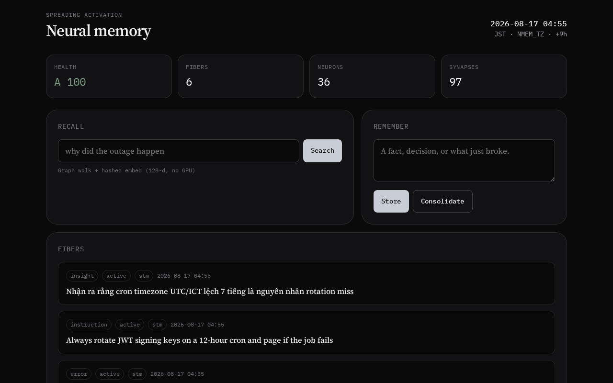

# nmem

**Spreading-activation memory for agents. A graph brain, not a vector database.**

[](LICENSE)
[](https://www.rust-lang.org/)
[](docs/MCP.md)

You write a sentence. nmem builds neurons, typed synapses, and a fiber. You ask *why*. Activation spreads along `CAUSED_BY` — not a cosine blob.

One static Rust binary (a few MB release). No Python. No GPU. No model download.



This is a hardware-light port of [neural-memory](https://github.com/nhadaututtheky/neural-memory), plus an OpenClaw MCP server and a local dashboard.

## Why not a vector DB?

“What *caused* the outage?” is a walk on a typed graph. Embeddings throw that structure away. nmem keeps it.

A 128-d hashed n-gram vector only *nudges* ranking for paraphrases. It is computed on the fly, never stored, never the primary index.

## Install

```bash
git clone https://github.com/6c696e68/nmem.git
cd nmem
cargo build --release
sudo cp target/release/nmem /usr/local/bin/
sudo cp target/release/nmem-mcp /usr/local/bin/   # optional MCP alias
```

Needs Rust 1.75+. No extra system libraries.

## Quick start

```bash
nmem remember "JWT expiry caused the Tuesday outage because the rotation cron failed"
nmem remember "We decided to use Redis for the session store instead of JWT-only auth"
nmem recall "why did the outage happen"
nmem causal "outage"
nmem tz
nmem dash          # dashboard on 0.0.0.0:8080
```

Default brain: `~/.neuralmemory/brains/default.json`  
Override with `--brain path.json` or `NMEM_BRAIN`.

## CLI

| Command | Purpose |
| --- | --- |
| `remember <text>` | Encode a memory (`--type`, `--tag`) |
| `recall <query>` | Spread activation and rank fibers |
| `causal <query>` | BFS on `CAUSED_BY` |
| `effects <query>` | BFS on `LEADS_TO` |
| `link <a> <b>` | Manual synapse (`--type caused_by`) |
| `forget <query>` | Delete the best-matching fiber |
| `context <query>` | Token-budgeted prompt pack |
| `consolidate` | Decay, promote stages, merge, expire |
| `health` / `stats` / `list` | Inspect the graph |
| `export` / `import` | Snapshot JSON |
| `mcp` | JSON-RPC 2.0 NDJSON on stdio |
| `dash` | Local HTTP dashboard |
| `tz` | Print detected timezone |

## OpenClaw / MCP

```bash
nmem mcp
```

JSON-RPC 2.0, newline-delimited JSON on stdio. Mutating tools persist the brain **before** the response is written.

Point the stock OpenClaw plugin (`python -m neural_memory.mcp`) at this binary:

```bash
export NMEM_BIN=/usr/local/bin/nmem
export PYTHONPATH=/path/to/nmem/compat:$PYTHONPATH
```

Twelve tools Claw actually calls — not the 63-tool Python kitchen sink. See [docs/MCP.md](docs/MCP.md).

## Timezone

“Today”, “hôm nay”, “Tuesday” use the **local** calendar.

1. `NMEM_TZ_HOURS` (`7`, `9`, `-5`)
2. `NMEM_TZ` (`JST`, `ICT`, `UTC`, `+07:00`)
3. libc `tm_gmtoff`
4. UTC

## Performance

Designed for weak hardware (CPU only, low RAM):

- **Exact content index** — neuron reuse is O(1), not a full scan
- **Anchor overlap** via inverted index with caps (no full-graph walk on encode)
- **Spreading activation** caches lightweight edges (no Neuron/Synapse clones per hop)
- **Recall** scores by id first; clones only the top-ranked fiber bodies
- **Simhash ALIAS** compares a recent window only

Stress (debug build, ballpark): ~1k encodes in tens of seconds; repeated recall stays in the low tens of milliseconds with flat RSS.

## Hardware

Cheap VPS, laptop, OpenClaw box with no GPU. CPU only. A few tens of MB of RAM for typical brains. One JSON file on disk. Offline at runtime.

## Tests

```bash
cargo test
```

Engine, real MCP child process, dashboard HTTP, and optional stress suites (`stress_encode`, `stress_load`) are included.

## Docs

- [Architecture](docs/ARCHITECTURE.md)
- [MCP](docs/MCP.md)
- [Rules](RULES.md) — invariants (persist-before-ack, no Bayes-on-recall, index rules)
- [Contributing](CONTRIBUTING.md)

## License

MIT. See [LICENSE](LICENSE).
